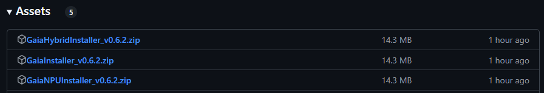

#  Introducing GAIA by AMD: Generative AI Is Awesome!

**GAIA is an open-source solution designed for the quick setup and execution of generative AI applications on local PC hardware.** It enables fast and efficient execution of LLM-based applications using a hybrid hardware approach that combines the AMD Neural Processing Unit (NPU) and Integrated Graphics Processing Unit (iGPU) in the Ryzen-AI PC. GAIA provides the following key features:

**Currently supports Windows 11 Home/Pro**

- 🏠 **Local LLM Processing**: Easily run powerful language models directly on your Windows device without cloud dependencies
- 🎯 **Multiple Use Cases**: From basic chat to RAG-enhanced applications and specialized agents
- ⚡ **Optimized Performance**: Leverages the AMD NPU and iGPU for hybrid acceleration to get fast and efficient AI processing
- 🖥️ **Easy-to-Use Interface**: Provides both a command-line interface (CLI) and a graphical user interface (GUI) option for easy interaction with models and agents
- 🔧 **Extensible Architecture**: Easily build and integrate your own agents and use cases
- 🔄 **Dual Mode**: GAIA comes in two flavors:
   - **Hybrid Mode**: Optimized for Ryzen AI PCs, combining AMD Neural Processing Unit (NPU) and Integrated Graphics Processing Unit (iGPU) for maximum performance
   - **Generic Mode**: Compatible with any Windows PC, using Ollama as the backend

For more details, see the [Frequently Asked Questions](docs/faq.md).

## Contents:

1. [Getting Started](#getting-started)
   - [Installation Steps](#installation-steps)
   - [Uninstallation Steps](#uninstallation-steps)
   - [Running the GAIA GUI](#running-the-gaia-gui)
   - [Running the GAIA CLI](#running-the-gaia-cli)
   - [Building from Source](#building-from-source)
1. [Features](#features)
1. [Contributing](#contributing)
1. [Prerequisites](#prerequisites)
1. [FAQ](#faq)
1. [Contact](#contact)
1. [License](#license)

# Getting Started Guide

The quickest way to get started with GAIA is by using one of the provided installers. There are two options available:

1. **GAIA_Hybrid_Installer.exe**: For running agents with the Hybrid (NPU+iGPU) execution on Ryzen AI PCs. This is the recommended installer that offers the best performance.
1. **GAIA_Installer.exe**: For running agents on non-Ryzen AI PCs, this uses Ollama as the backend. 

Each installer includes both a CLI tool and a GUI. The installation process typically takes about 5-10 minutes, depending on your Wi-Fi connection, and provides everything you need to start working with LLMs.

⚠️ NOTE: When running GAIA using the Hybrid mode, please make sure to disable any discrete third-party GPUs in Device Manager.

## Installation Steps

To install the GAIA application, please follow these steps:
1. Make sure you meet the minimum system requirements [here](#system-requirements)
1. Download the [latest release](https://github.com/amd/gaia/releases) of the GAIA installers from the "Assets" section:
   
   1. If you have a Ryzen AI PC, choose the Hybrid installer, otherwise choose the generic installer.

1. Unzip the downloaded file and run the installer by double-clicking the .exe file.

   ⚠️ **NOTE**: If you get a Windows Security warning, you can verify the application by clicking *"More info"* and then *"Run anyway"*. This warning appears because the application is not digitally signed.

   ⚠️ **NOTE**: Note that the installer will attempt to write to the same directory by default and may overwrite a previous installation of GAIA. Change the target directory if you want to avoid this.

1. Follow the on-screen instructions to complete the installation. You may be prompted to delete existing installation of GAIA if a previous version was installed.
   1. The process will take about 5-10 minutes depending on your Wi-Fi connection and includes everything needed to get up and running with LLMs on Ryzen AI.

1. Once installation is complete, two desktop icons will be created.
   1. GAIA-CLI - Double click this icon to launch the CLI tool.
   1. GAIA-GUI - Double click this icon to launch the GUI tool.

## Uninstallation Steps

⚠️ **NOTE**: There is currently no automatic uninstaller available for GAIA, but one is coming soon. For now, you must manually remove GAIA from your system.

To completely uninstall GAIA from your system, follow these steps:

1. Close all running instances of GAIA (both CLI and GUI).

2. Remove the GAIA folder from AppData:
   1. Press `Win + R` to open the Run dialog
   2. Type `%localappdata%` and press Enter
   3. Find and delete the `GAIA` folder

3. Remove model files from the cache folder:
   1. Press `Win + R` to open the Run dialog
   2. Type `%userprofile%\.cache` and press Enter
   3. Delete any GAIA-related model folders (such as `huggingface` and `lemonade`)

4. Remove desktop shortcuts:
   1. Delete the GAIA-CLI and GAIA-GUI shortcuts from your desktop

## Running the GAIA GUI

Check your desktop for the GAIA-GUI icon and double-click it to launch the GUI. The first time you launch GAIA, it may take a few minutes to start. Subsequent launches will be faster. You may also need to download the latest LLM models from Hugging Face. GAIA will handle this automatically but may request a Hugging Face token for access. If you encounter any issues with model downloads or the GUI application, please contact the [AMD GAIA team](mailto:gaia@amd.com).

## Running the GAIA CLI

To quickly get started with GAIA via the command line, you can use the GAIA CLI (`gaia-cli`) tool. Double click on the GAIA-CLI icon and run `gaia-cli -h` for help details. For more information and examples, please refer to the [gaia-cli documentation](docs/cli.md).

## Building from Source

To get started building from source, please follow the latest instructions [here](./docs/dev.md). These instructions will setup the [Onnx Runtime GenAI](https://github.com/microsoft/onnxruntime-genai) through the [Lemonade Web Server](https://github.com/onnx/turnkeyml/blob/main/docs/lemonade/getting_started.md) tool targeting the Ryzen AI SoC.

⚠️ **NOTE**: You may need to install Ollama from [here](https://ollama.com/download) if you plan to use the GAIA generic installer and run models with the Ollama backend.

# Features

For a list of features and supported LLMs, please refer to the [Features](docs/features.md) page.

# Contributing

This is a new project with a codebase that is actively being developed. If you decide to contribute, please:
- Submit your contributions via a Pull Request.
- Ensure your code follows the same style as the rest of the repository.

The best way to contribute is by adding a new agent that covers a unique use-case. You can use any of the agents/bots under the ./agents folder as a starting point. If you prefer to avoid UI development, you can add a feature to the CLI tool first. For adding features to the GUI, please refer to our [UI Development Guide](docs/ui.md).

## System Requirements

GAIA with Ryzen AI Hybrid NPU/iGPU execution has been tested on the following systems. Any system that has the AMD Ryzen AI 9 HX 370 with NPU Driver 32.0.203.237 or higher should work. If you do not have access to a Ryzen AI system below, please use the generic installer instead.

- Systems: Asus ProArt PX13/P16, HP Omnibook or similar PC system with Ryzen AI 9 HX 370 or higher.
- OS: Windows 11 Pro/Home (GAIA does not support macOS or Linux at this time, [contact us](mailto:gaia@amd.com) if you need support for a particular platform)
- Processor: AMD Ryzen AI 9 HX 370 w/ Radeon 890M, 2000 Mhz, 12 Core(s), 24 Logical Processor(s)
- AMD Radeon 890M iGPU drivers: `32.0.12010.8007` and `32.0.12033.1030`
- AMD NPU drivers: `32.0.203.237` or `32.0.203.240`
- AMD Adrenalin Software: Install the latest version from [AMD's official website](https://www.amd.com/en/products/software/adrenalin.html)
- Physical Memory: Minimum 16GB, Recommended 32GB
- For Hybrid mode: AMD Ryzen AI 9 HX 370 with NPU Driver `32.0.203.237` or `32.0.203.240`
- For Generic mode: Any Windows PC meeting Ollama's system requirements

⚠️ **NOTE**: For Hybrid mode, NPU Driver `32.0.203.242` is not compatible, please revert driver to `32.0.203.240`. You can check your driver version by going to *Device Manager -> Neural Processors -> NPU Compute Accelerator Device -> Right-Click Properties -> Driver Tab -> Driver Version*.

## Dependencies

The GAIA installer will automatically set up most dependencies, including:
- Python 3.10
- Miniconda (if not already installed)
- FFmpeg
- Ollama *(Generic mode only)*
- All required Python packages

# FAQ

For frequently asked questions, please refer to the [FAQ](docs/faq.md).

# Contact

Contact [AMD GAIA Team](mailto:gaia@amd.com) for any questions, feature requests, access or troubleshooting issues.

# License

[MIT License](./LICENSE.md)

Copyright(C) 2024-2025 Advanced Micro Devices, Inc. All rights reserved.
SPDX-License-Identifier: MIT