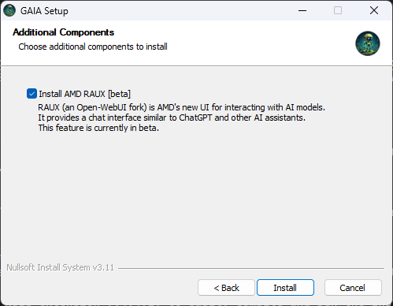

# GAIA Installer Guide

**Note:** This installer is for Windows only. For Linux systems, see the [Linux Installation Guide](../README.md#linux-installation) for source-based installation.

## GAIA Installation (Windows Only)

GAIA is specifically designed for AMD Ryzen AI systems and uses Lemonade Server for optimal hardware utilization including NPU and iGPU capabilities.

## Prerequisites

### Required Components

1. **Conda Environment** (All Modes)
   - Miniconda will be automatically installed if missing
   - Creates Python 3.10 environment named 'gaia_env'

2. **Ryzen AI Driver** (Ryzen AI Systems Only)
   - Required version: Latest available
   - Will be automatically downloaded and installed if needed
   - Installer checks current version and offers updates

## Installation Process

### 1. Pre-Installation Checks
- Verifies system requirements
- Checks for existing GAIA installation
- Removes previous versions if found
- Initializes installation logging
- Detects CPU compatibility for Ryzen AI systems

### 2. Environment Setup
The installer automatically:
- Checks for and installs Miniconda if needed
- Creates dedicated conda environment: gaia_env
- Configures Python 3.10
- Sets required environment variables
- Creates activation scripts

### 3. Additional Components

- Downloads required LLM artifacts
- For Ryzen AI systems:
  - Checks Ryzen AI driver version
  - Offers automatic driver updates
  - Installs Ryzen AI wheel packages
- Configures settings.json for optimal performance

<!-- ### 5. AMD RAUX (Beta)



During installation, you can choose to install AMD RAUX (beta), AMD's new UI for interacting with AI models:
- RAUX (an Open-WebUI fork) is AMD's new UI for interacting with AI models
- Provides a chat interface similar to ChatGPT and other AI assistants
- Offers a modern, intuitive interface for conversational AI interactions
- Installed separately from the main GAIA application
- Creates its own desktop shortcut for easy access

To launch RAUX after installation:
- Click the RAUX desktop shortcut created during installation
- The application will open in your default web browser
- For technical support with RAUX, contact support@amd.com -->

### 4. Final Setup
- Creates desktop shortcuts
- Sets up launch configuration
- Validates installation

## Running the Installer

### GUI Installation
The graphical interface comes bundled with GAIA, use the standard installation steps outlined [here](../README.md#getting-started-guide) and follow the prompts to install it.

### Command-Line Installation
For silent or automated installations, use command-line parameters:

```
gaia-windows-setup.exe /S
```

Available parameters:
- `/S` - Silent installation (no UI)
- `/D=<path>` - Set installation directory (must be last parameter)

### CI/CD Environments
For continuous integration and deployment scenarios, use:

```
gaia-windows-setup.exe /S
```

## Building the Installer

To build the installer from source:
1. Install [NSIS 3.10](https://prdownloads.sourceforge.net/nsis/nsis-3.10-setup.exe?download)
2. Navigate to the installer directory
3. Run `"C:\Program Files (x86)\NSIS\makensis.exe" Installer.nsi` to compile the installer
4. The compiled installer will be created as `gaia-windows-setup.exe`

For builds that include NPU functionality, provide the OGA token:
```
"C:\Program Files (x86)\NSIS\makensis.exe" /DOGA_TOKEN=<token> Installer.nsi
```

## Debugging

Debugging the installer could be tricky on a workflow since NSIS does not log anything that happens inside an `execWait` when running on a GitHub Workflow. To go around that, simply run the installer locally. To debug locally you have two options:

### Option 1: GUI installation
* Change all `ExecWait`s inside `Installer.nsi` to `Exec`. This will make sure terminals are not closed once something fails.
* Compile and run normally

### Option 2: Silent mode through terminal
* From a `Command Prompt` console, run `gaia-windows-setup.exe /S`. All logs will be shown on the screen.
* To log detailed output, use `gaia-windows-setup.exe /S /LOG=install_log.txt`

 ⚠️ NOTE: Optionally install the NSIS extension (v4.4.1) to easily compile and run the installer from within VSCode.

## Troubleshooting

If you encounter installation issues:
1. Check the installation logs - you can generate detailed logs by running `gaia-windows-setup.exe /LOG=install_log.txt`
2. Verify system requirements are met
3. For Ryzen AI systems, verify your processor and drivers are properly detected

Common issues:
- **Hardware Compatibility**: The installer detects available hardware capabilities
- **Driver Incompatibility**: For Ryzen AI systems, ensure you have compatible NPU drivers
- **Installation Path**: Avoid paths with special characters or very long directory names

## Environment Variable Handling

### PATH Environment Variable
The installer automatically adds two directories to your system PATH:
1. `<install_dir>\bin` - Contains GAIA command-line tools and scripts
2. `<install_dir>\python\Scripts` - Contains Python executable scripts

This process:
- Uses direct registry manipulation to avoid Windows `setx` command's 1024-character limit
- Preserves all existing PATH entries
- Handles scenarios like empty PATH or very long PATH values
- Avoids duplicate entries if reinstalling
- Includes error handling with user prompts if registry operations fail

If the installer can't update your PATH:
- A warning message will be displayed
- You can choose to continue or abort installation
- If you continue, you may need to add GAIA directories to PATH manually

### Manual PATH Management
If you need to manually add GAIA to your system PATH:
1. Open System Properties > Advanced > Environment Variables
2. Edit the 'Path' variable in User Variables
3. Add `<install_dir>\bin` and `<install_dir>\python\Scripts`
4. Click OK to save changes

### Other Environment Variables
The installer also sets:
- `GAIA_INSTALL_DIR` - Points to the main installation directory

# Contact
Contact [GAIA team](mailto:gaia@amd.com) for any questions, feature requests, access or troubleshooting issues.

# License

[MIT License](../LICENSE.md)

Copyright(C) 2024-2025 Advanced Micro Devices, Inc. All rights reserved.
SPDX-License-Identifier: MIT