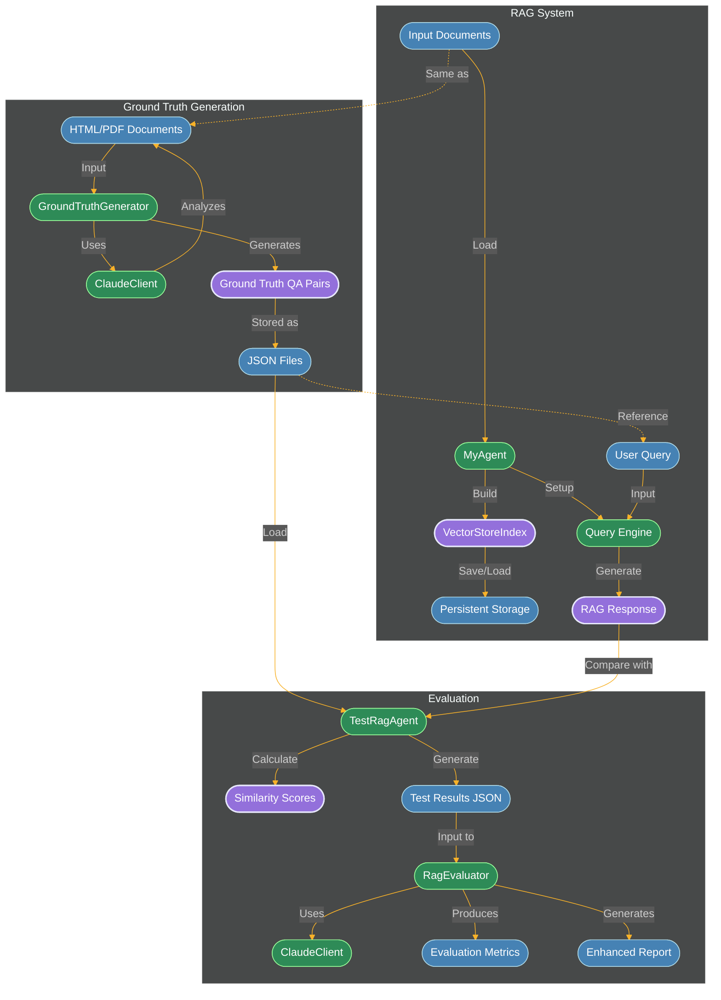

# LLM Evaluation and RAG Pipeline

## Problem Statement

Retrieval-Augmented Generation (RAG) systems are increasingly critical for enterprise applications that require accurate, reliable, and contextually relevant responses based on proprietary data sources. However, evaluating RAG systems presents unique challenges:

1. **Domain-Specific Knowledge**: Traditional evaluation metrics often fail to capture the nuances of specialized knowledge domains.
2. **Data Source Variability**: Different document types (HTML, PDF, etc.) and structures require tailored evaluation approaches.
3. **Subjective Quality Assessment**: Determining what constitutes a "good" response often requires human-like judgment.
4. **Reliability Requirements**: Enterprise applications demand high reliability and consistency across diverse queries.
5. **Iteration Speed**: Improving RAG systems requires rapid feedback loops to identify and address weaknesses.

This evaluation pipeline addresses these challenges by providing a comprehensive framework for assessing and improving RAG systems with custom data sources.

## Solution Overview

This diagram visualizes the Retrieval-Augmented Generation (RAG) evaluation pipeline, showing how ground truth data is generated, how the RAG system processes queries, and how the evaluation is performed.

## Key Insights and Evaluation Framework

### Scaling Subjective Evaluation with LLMs
- **Automated Quality Assessment**: Uses Claude to perform detailed qualitative analysis of RAG responses, evaluating correctness, completeness, conciseness, and relevance.
- **Beyond Simple Similarity**: While similarity scores provide a quantitative baseline (averaging ~0.58 in sample evaluations), the system evaluates responses across four critical dimensions:
  - **Correctness**: Factual accuracy relative to source documents
  - **Completeness**: Whether responses fully address all aspects of the query
  - **Conciseness**: Appropriate brevity while maintaining accuracy
  - **Relevance**: Direct alignment with the user's information need
- **Consistent Judgment**: Provides standardized evaluation criteria across different document types and query patterns.
- **Reduced Human Review**: Minimizes the need for manual review while maintaining high-quality assessment.

### Generating Actionable Insights
- **Strength/Weakness Analysis**: Automatically identifies what the RAG system does well and where it needs improvement.
- **Pattern Recognition**: Detects patterns in query types that perform well or poorly.
- **Targeted Recommendations**: Generates specific suggestions for improving retrieval and generation components.

### Enabling Rapid Design Iteration
- **Quantitative Metrics**: Provides objective similarity scores and pass/fail rates to track improvements.
- **Qualitative Feedback**: Delivers detailed analysis of response quality to guide refinements.
- **Regression Testing**: Allows continuous testing to ensure changes improve rather than degrade performance.

### Pipeline Components and Data Flow

#### Three Core Modules
1. **Ground Truth Generation**
   - **GroundTruthGenerator**: Uses Claude to analyze documents and generate question-answer pairs
   - **Ground Truth QA Pairs**: Generated Q&A pairs stored as JSON files

2. **RAG System**
   - **MyAgent**: Main RAG agent implementation
   - **VectorStoreIndex**: Vector database for document embeddings
   - **Query Engine**: Processes queries against the index to generate responses

3. **Evaluation**
   - **TestRagAgent**: Test harness that compares RAG responses to ground truth
   - **RagEvaluator**: Evaluates test results using Claude to assess quality dimensions
   - **Enhanced Report**: Detailed analysis of response quality across multiple dimensions

#### Process Flow
1. Documents are processed to generate ground truth Q&A pairs
2. The same documents are indexed by the RAG system
3. Test queries from ground truth are run through the RAG system
4. RAG responses are compared to ground truth answers
5. Evaluation metrics and reports are generated

## Recommendations for Implementation and Improvement

### Technical Implementation
1. **Balanced Response Configuration**:
   - Implement configurable thresholds for the trade-off between conciseness and completeness
   - Add parameters to control detail level based on query complexity

2. **Enhanced Retrieval Mechanisms**:
   - Implement hybrid retrieval combining semantic search with keyword-based methods
   - Add re-ranking of retrieved documents based on query relevance

3. **Evaluation Automation**:
   - Create CI/CD pipeline integration for continuous RAG evaluation
   - Develop dashboards to track performance metrics over time

### Strategic Considerations
1. **Domain Adaptation**:
   - Fine-tune evaluation criteria based on specific industry requirements
   - Create domain-specific ground truth generation prompts

2. **User Feedback Integration**:
   - Implement mechanisms to incorporate user feedback into evaluation metrics
   - Develop A/B testing framework to validate improvements

3. **Continuous Learning**:
   - Establish processes to periodically update ground truth based on new information
   - Create feedback loops between evaluation results and RAG system improvements

## Expected Benefits
- **Higher Quality Responses**: More balanced, accurate, and contextually appropriate answers
- **Faster Iteration**: Quantifiable metrics enable rapid testing and improvement cycles
- **Reduced Manual Oversight**: Automated evaluation reduces the need for human review
- **Better User Experience**: Responses tailored to specific use cases and information needs
- **Measurable ROI**: Clear metrics to demonstrate system improvements over time