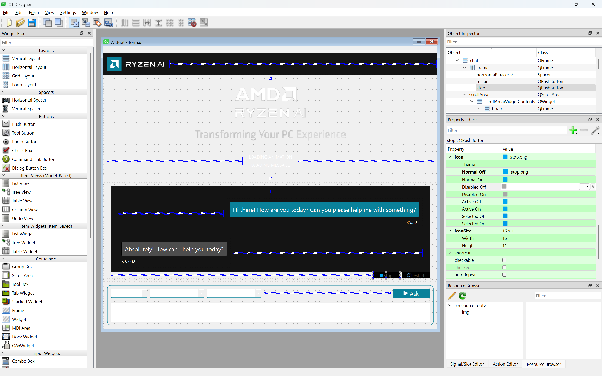

# GAIA UI Documentation

## Table of Contents
- [GAIA UI Documentation](#gaia-ui-documentation)
  - [Table of Contents](#table-of-contents)
- [UI Overview](#ui-overview)
- [Qt Interface](#qt-interface)
  - [Prerequisites](#prerequisites)
  - [Using Qt Designer](#using-qt-designer)
    - [Launching Qt Designer](#launching-qt-designer)
    - [Editing the UI](#editing-the-ui)
    - [Working with Assets](#working-with-assets)
  - [Compiling Changes](#compiling-changes)
  - [Troubleshooting](#troubleshooting)
- [RAUX Interface](#raux-interface)
  - [New in GAIA BETA (RAUX)](#new-in-gaia-beta-raux)
- [License](#license)

# UI Overview

GAIA provides two user interface experiences:
1. The Qt-based interface - A robust desktop application interface built with PyQt6
2. RAUX [beta] - A modern web-based interface built on Open-WebUI

?? **NOTE**: RAUX is currently disabled pending review, will be available in v0.8.4.

# Qt Interface

This guide explains how to modify and enhance the GAIA Qt user interface using Qt Designer. Qt Designer is a visual design tool that allows you to create and edit graphical user interfaces without writing code directly. This guide covers:

- Setting up the UI development environment
- Using Qt Designer to modify the interface
- Compiling and testing UI changes
- Working with assets and resources



## Prerequisites

1. A working GAIA installation (see [README](README.md))
2. Python environment with GAIA dependencies installed
3. UI development dependencies: `pip install -e PyQt6, pyqt6-tools`

## Using Qt Designer

### Launching Qt Designer
1. Navigate to your Python environment's Qt applications directory:
   ```bash
   C:\Users\<YOUR_USER>\miniconda3\envs\<YOUR_GAIA_ENV>\Lib\site-packages\qt6_applications\Qt\bin
   ```
2. Run `designer.exe`

### Editing the UI
1. In Qt Designer, open `src/gaia/interface/form.ui`
2. Make your desired changes to the interface
3. Save the file

### Working with Assets
If you need to add new assets (icons, images, etc.):
1. Place the new assets under `src/gaia/interface/img`
2. Update the resource file `src/gaia/interface/resource.qrc`
3. Make sure to reference the assets correctly in your UI design

## Compiling Changes

After making changes, you need to compile the updated files:

1. Navigate to the interface directory:
   ```bash
   cd src/gaia/interface
   ```

2. Compile the UI form:
   ```bash
   pyside6-uic form.ui -o ui_form.py
   ```

3. If you modified resources (optional):
   ```bash
   pyside6-rcc resource.qrc -o rc_resource.py
   ```

4. Fix the resource import in `ui_form.py`:
   - Find: `import resource_rc`
   - Replace with: `import gaia.interface.rc_resource as rc_resource`

5. Test your changes by running:
   ```bash
   gaia
   ```

## Troubleshooting

- If Qt Designer doesn't launch, verify your Python environment is activated
- If resources aren't showing up, ensure you've recompiled both the UI and resource files
- For import errors, check that the resource path replacement was done correctly

# RAUX Interface

- **GAIA BETA (also referred to as RAUX for RyzenAI User Experience)** is a modern web-based interface for GAIA, built as a fork from [Open-WebUI](https://github.com/open-webui/open-webui). It provides an extensible, feature-rich, and user-friendly self-hosted AI platform. GAIA BETA is currently in beta and is being actively integrated with new features and improvements rolling out regularly. While it offers a modern web-based experience, please note that it's still under development and some features may be experimental.

## New in GAIA BETA (RAUX)
- Improved error handling and progress reporting via inter-process communication (IPC) between the main and renderer processes.
- Unified GAIA BETA branding and updated messaging throughout the installer and UI.
- For technical details on the integration, IPC, and installer, see [CLAUDE.md](../CLAUDE.md).

### 🙏 **Acknowledgments: RAUX & OpenWebUI**

#### **Built on OpenWebUI Foundation**

RAUX (RyzenAI UX) is built upon the excellent foundation provided by **OpenWebUI**, an outstanding open-source project that has revolutionized how users interact with AI models through web interfaces.

#### **Special Thanks**

We extend our heartfelt gratitude to:

- **[Timothy Jaeryang Baek](https://github.com/tjbck)** and the entire **OpenWebUI team** for creating and maintaining such an exceptional open-source project
- The **OpenWebUI community** for their continuous contributions, feedback, and innovation
- All **open-source contributors** who have helped shape the modern AI interface landscape

#### **Open Source Heritage**

RAUX builds upon OpenWebUI's solid architectural foundation while adding AMD-specific optimizations and integrations tailored for the GAIA ecosystem. This collaboration exemplifies the power of open-source software in advancing AI accessibility and user experience. The OpenWebUI project's commitment to creating intuitive, powerful, and extensible AI interfaces has made GAIA BETA possible. 

**Learn more about OpenWebUI**: [https://github.com/open-webui/open-webui](https://github.com/open-webui/open-webui)

---

For more information about GAIA BETA (RAUX), including setup instructions and feature documentation, please refer to the [RAUX GitHub repository README](https://github.com/aigdat/raux/blob/main/README.md).

# License

[MIT License](../LICENSE.md)

Copyright(C) 2024-2025 Advanced Micro Devices, Inc. All rights reserved.
SPDX-License-Identifier: MIT
